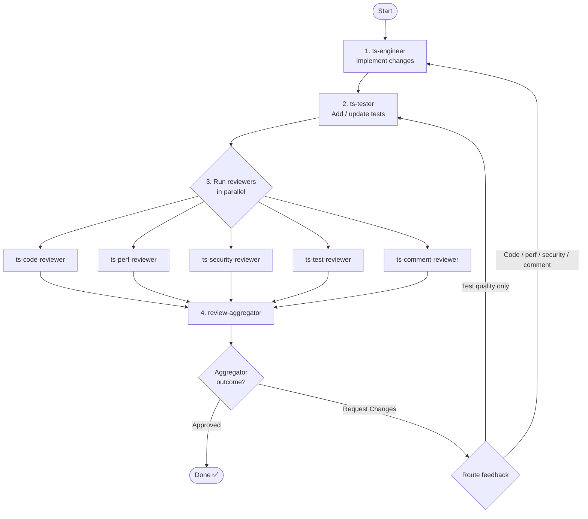

Implement the task provided at the end of this prompt using the structured workflow below. If the task is empty, ask the user to describe what they want implemented before proceeding.

Before beginning your work, create a worktree and branch with a name that follows conventional branch naming conventions.

---

## Workflow



---

## Phase 1: Implement and Review

### Step 1 — Implement (`ts-engineer`)

Spawn the `ts-engineer` subagent. Its prompt must include:

- The full contents of the `<task>` block at the bottom of this prompt
- On iterations 2+: the complete aggregated review output from the previous iteration (all Must Fix, Should Fix, and Consider comments), framed as _"Address the following review feedback:"_

Wait for it to complete before proceeding.

### Step 2 — Write Tests (`ts-tester`)

Spawn the `ts-tester` subagent. Its prompt must include:

- The full contents of the `<task>` block at the bottom of this prompt
- Which source files `ts-engineer` modified (extract from its output)
- On iterations 2+: the complete aggregated review output from the previous iteration (all Must Fix, Should Fix, and Consider comments), framed as _"Address the following review feedback:"_

Wait for it to complete before proceeding.

### Step 3 — Run All Reviewers in Parallel

In a **single message**, spawn all five reviewer subagents simultaneously. Each reviewer's prompt must include:

- The full contents of the `<task>` block at the bottom of this prompt

Reviewers to spawn:

- `ts-code-reviewer`
- `ts-comment-reviewer`
- `ts-perf-reviewer`
- `ts-security-reviewer`
- `ts-test-reviewer`

Do not run them sequentially — all five must be launched in the same message.

Wait for all five to complete before proceeding.

### Step 4 — Aggregate Reviews (`review-aggregator`)

Spawn the `review-aggregator` subagent. Pass it the **complete text output** from all five reviewers, labelled by reviewer:

```
=== ts-code-reviewer ===
<full output>

=== ts-perf-reviewer ===
<full output>
...
```

Do **not** filter or address reviewer feedback yourself — the aggregator decides what survives.

Wait for it to complete.

### Step 5 — Route or Finish

Read the aggregated review outcome:

**Approved** — workflow complete. Report to the user: what was implemented, which files changed, and that all reviews passed.

**Request Changes** — determine the restart point, then pass each agent the comments relevant to its category (Must Fix, Should Fix, and Consider):

- If any comment relates to source code, performance, security, or comment quality on production code → restart from **Step 1** (`ts-engineer`)
- If all comments relate only to test quality or coverage → restart from **Step 2** (`ts-tester`)

Regardless of restart point, each agent that runs receives the comments for its own domain:

- `ts-engineer` receives code, performance, security, and comment-quality feedback
- `ts-tester` receives test quality and coverage feedback

**Iteration cap**: after **5 full iterations** without an Approved outcome, pause and show the user the remaining feedback. Ask whether to continue for another round or stop. Do not loop again until the user responds.

**Pipeline rule**: whenever you restart at any step, you **must** run every step that follows it in order. Never skip downstream steps.

---

## Rules

- Every `Agent` tool call runs in an isolated context. Pass all necessary information explicitly in each subagent's prompt — never assume a subagent inherits prior conversation state.
- Step 3 reviewers **must** be launched in a single message as parallel `Agent` tool calls. Sequential execution is not acceptable.
- Do not address review feedback yourself. Route it to the appropriate subagent.
- Do not run `npm run quality` yourself — the engineer and tester agents run their own quality checks.
- Do not modify files directly. All code changes go through `ts-engineer` and `ts-tester`.

---

## Task

<task>
$ARGUMENTS
</task>
