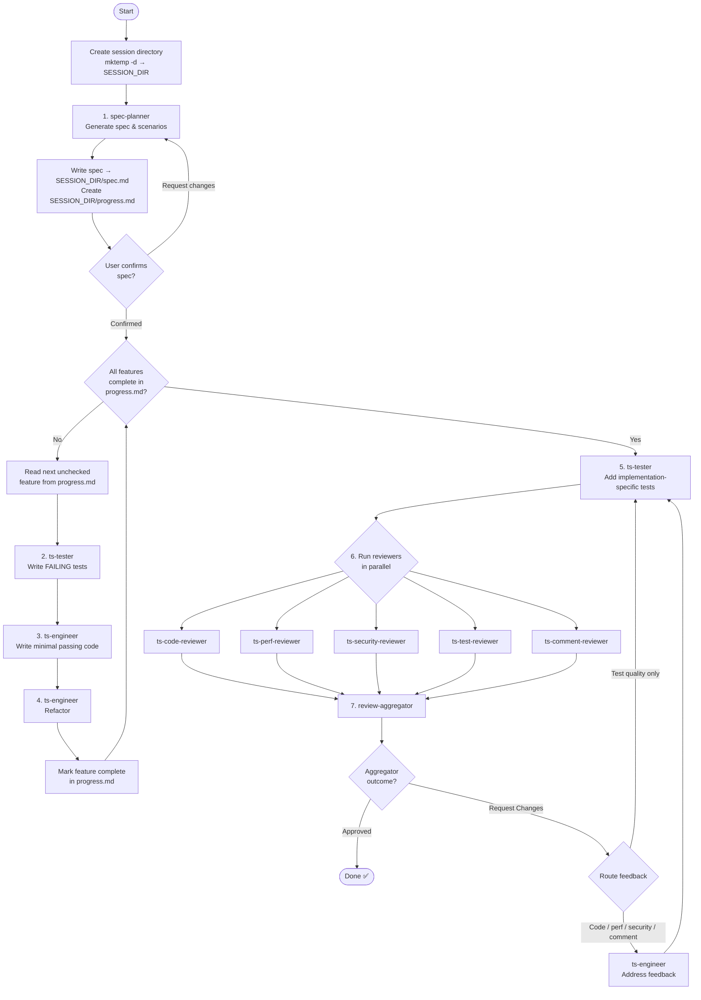

Implement the task provided at the end of this prompt using a test-driven development workflow. If the task is empty, ask the user to describe what they want implemented before proceeding.

---

## Workflow



---

## Phase 1: Planning

### Step 0 — Create Session Directory

Run `mktemp -d` and record the result as `SESSION_DIR`. All session files go here.

### Step 1 — Generate Spec (`spec-planner`)

Spawn the `spec-planner` subagent. Its prompt must include:

- The full contents of the `<task>` block at the bottom of this prompt

The spec-planner may ask the user clarifying questions before returning — wait for it to complete fully.

When it returns:

1. Write the full spec output to `$SESSION_DIR/spec.md`
2. Read the `### Features` section of the spec and create `$SESSION_DIR/progress.md` with one unchecked item per feature, preserving the order from the spec:

```markdown
# Progress

- [ ] Feature 1: <name>
- [ ] Feature 2: <name>
      ...
```

### Step 2 — Confirm Spec with User

Tell the user the spec has been written to `$SESSION_DIR/spec.md` and ask them to review it. Wait for their response before proceeding.

- If they confirm: continue to Phase 2
- If they request changes: re-spawn `spec-planner` with the original task and their feedback, then overwrite `$SESSION_DIR/spec.md` and `$SESSION_DIR/progress.md` with the updated output. Repeat until confirmed.

---

## Phase 2: TDD Loop

Repeat Steps 3–5 for each feature until `$SESSION_DIR/progress.md` has no unchecked items.

At the start of each iteration, read `$SESSION_DIR/progress.md` to find the first unchecked feature. That is the current feature.

### Step 3 — Write Failing Tests (`ts-tester`)

Spawn the `ts-tester` subagent. Its prompt must include:

- The spec file path: `$SESSION_DIR/spec.md` — instruct it to read this file for the full spec
- The name and description of the **current feature only**
- The list of features already marked complete in `$SESSION_DIR/progress.md` (so it can avoid duplicating existing tests)
- Explicit instruction: _"Write tests for this feature that currently FAIL. Do not write any production code. Tests must fail because the feature is not yet implemented, not because of syntax errors or missing imports."_

Wait for it to complete before proceeding.

### Step 4 — Write Minimal Passing Code (`ts-engineer`)

Spawn the `ts-engineer` subagent. Its prompt must include:

- The spec file path: `$SESSION_DIR/spec.md` — instruct it to read this file for the full spec
- The name and description of the **current feature only**
- The test file(s) written in Step 3 (extract file paths from ts-tester output)
- Explicit instruction: _"Write the minimum production code required to make the failing tests pass. Do not implement functionality beyond what the tests require. Do not refactor yet."_

Wait for it to complete before proceeding.

### Step 5 — Refactor (`ts-engineer`)

Spawn the `ts-engineer` subagent. Its prompt must include:

- The spec file path: `$SESSION_DIR/spec.md` — instruct it to read this file for the full spec
- The name and description of the **current feature only**
- Explicit instruction: _"Refactor the implementation for clarity, structure, and maintainability. All existing tests must continue to pass. Do not add new functionality."_

Wait for it to complete. Update `$SESSION_DIR/progress.md` to mark the current feature complete (`- [x]`), then return to the top of the loop.

---

## Phase 3: Implementation Tests

### Step 6 — Add Implementation-Specific Tests (`ts-tester`)

Once all features are marked complete in `$SESSION_DIR/progress.md`, spawn the `ts-tester` subagent. Its prompt must include:

- The spec file path: `$SESSION_DIR/spec.md` — instruct it to read this file for the full spec
- The output of `git diff main...HEAD` (run it yourself and include the full diff)
- Explicit instruction: _"Review the implementation and add tests for behaviors, edge cases, or invariants that are specific to how the code was written and not already covered by the existing tests. Do not duplicate existing tests."_

Wait for it to complete before proceeding.

---

## Phase 4: Review Cycle

### Step 7 — Run All Reviewers in Parallel

In a **single message**, spawn all five reviewer subagents simultaneously. Each reviewer's prompt must include:

- The full contents of the `<task>` block at the bottom of this prompt

Reviewers to spawn:

- `ts-code-reviewer`
- `ts-comment-reviewer`
- `ts-perf-reviewer`
- `ts-security-reviewer`
- `ts-test-reviewer`

Do not run them sequentially — all five must be launched in the same message.

Wait for all five to complete before proceeding.

### Step 8 — Aggregate Reviews (`review-aggregator`)

Spawn the `review-aggregator` subagent. Pass it the complete text output from all five reviewers, labelled by reviewer:

```
=== ts-code-reviewer ===
<full output>

=== ts-perf-reviewer ===
<full output>
...
```

Do **not** filter or address reviewer feedback yourself — the aggregator decides what survives.

Wait for it to complete.

### Step 9 — Route or Finish

Read the aggregated review outcome:

**Approved** — workflow complete. Report to the user: what was implemented, which files changed, and that all reviews passed.

**Request Changes** — determine the restart point, then pass each agent the comments relevant to its category (Must Fix, Should Fix, and Consider):

- If any comment relates to source code, performance, security, or comment quality → spawn `ts-engineer` to address those comments, then restart from Step 6
- If all comments relate only to test quality or coverage → restart from Step 6

Regardless of restart point, each agent receives the comments for its own domain:

- `ts-engineer` receives code, performance, security, and comment-quality feedback
- `ts-tester` receives test quality and coverage feedback

**Iteration cap**: after **5 review iterations** without an Approved outcome, pause and show the user the remaining feedback. Ask whether to continue for another round or stop. Do not loop again until the user responds.

---

## Rules

- Step 7 reviewers **must** be launched in a single message as parallel `Agent` tool calls. Sequential execution is not acceptable.
- Do not write failing tests, passing code, or refactored code yourself — all code changes go through `ts-engineer` and `ts-tester`.
- Do not address review feedback yourself. Route it to the appropriate subagent.
- Do not run `npm run quality` yourself — the engineer and tester agents run their own quality checks.
- The TDD loop (Steps 3–5) is complete only when `$SESSION_DIR/progress.md` has no unchecked items. Do not skip to Phase 3 early.

---

## Task

<task>
$ARGUMENTS
</task>
